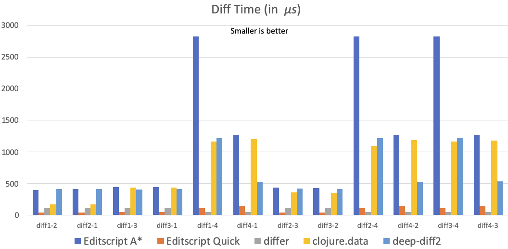
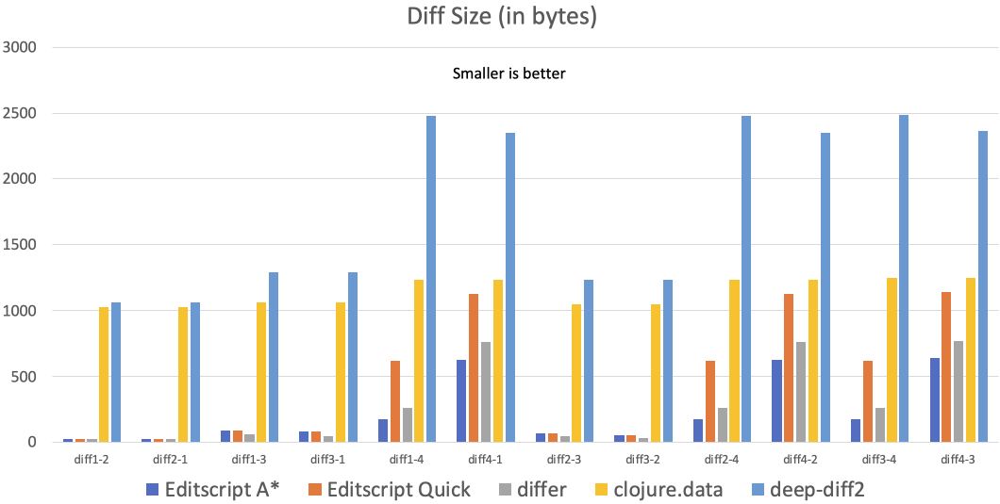

<p align="center"></img></p>
<h1 align="center">Editscript</h1>
<p align="center">🔦  Diff and patch for Clojure/Clojurescript data. 🧩	</p>

<p align="center">
<a href="https://badge.fury.io/js/clj-editscript"></img></a>
<a href="https://clojars.org/juji/editscript"></img></a>
<a href="https://github.com/juji-io/editscript/actions"></img></a>
</p>

## :hear_no_evil: What is it?

Editscript is a library designed to extract the differences between two
Clojure/Clojurescript data structures as an "editscript", which represents the
minimal modification necessary to transform one to another.

Currently, this library can diff and patch any nested Clojure/Clojurescript data
structures consisting of regular maps, vectors, lists, sets and values. Custom
data can also be handled if you implement our protocols.

## :satisfied: Status

This library is stable and has been in production use to power the core product
of [Juji](https://juji.io) for several years now. If you are also using
Editscript, please drop a line at issue
[#17](https://github.com/juji-io/editscript/issues/17) so we may make a list of
users here:

* [Oche](https://oche.com) uses Editscript to sync game state between client and server.
* [Streetlinx](https://streetlinx.com) uses Editscript to capture deltas to
  drive a newsfeed and generate alerts.
* [microdata.no](https://microdata.no) uses Editscript to sync client state to
  server so users can pick up their work where they left it.
* [Evident Systems](https://www.evidentsystems.com/) uses Editscript as the main
  way of evaluating changes within the convergent reference type in their CRDT
  library, [Converge](https://github.com/evidentsystems/converge).

## :tada: Usage

See my [Clojure/north 2020 Talk](https://youtu.be/n-avEZHEHg8): Data Diffing
Based Software Architecture Patterns.

```Clojure
(require '[editscript.core :as e])

;; Here are two pieces of data, a and b
(def a ["Hello word" 24 22 {:a [1 2 3]} 1 3 #{1 2}])
(def b ["Hello world" 24 23 {:a [2 3]} 1 3 #{1 2 3}])

;; compute the editscript between a and b using the default options
(def d (e/diff a b))

;; look at the editscript
(e/get-edits d)
;;==>
;; [[[0] :r "Hello world"] [[2] :r 23] [[3 :a 0] :-] [[6 3] :+ 3]]

;; diff using the quick algorithm and diff the strings by character
;; there are other string diff levels: :word, :line, or :none (default)
(def d-q (e/diff a b {:algo :quick :str-diff :character}))

(e/get-edits d-q)
;;=>
;; [[[0] :s [9 [:+ "l"] 1]] [[2] :r 23] [[3 :a 0] :-] [[6 3] :+ 3]]

;; get the edit distance, i.e. number of edits
(e/edit-distance d)
;;==> 4

;; get the size of the editscript, i.e. number of nodes
(e/get-size d)
;;==> 23

;; patch a with the editscript to get back b, so that
(= b (e/patch a d))
;;==> true
(= b (e/patch a d-q))
;;==> true

```

An Editscript contains a vector of edits, where each edit is a vector of two or
three elements.

The first element of an edit is the path, similar to the path vector in the
function call `update-in`. However, `update-in` only works for associative data
structures (map and vector), whereas the editscript works for map, vector, list
and set alike.

The second element of an edit is a keyword representing the edit operation,
which is one of `:-` (deletion), `:+` (addition), `:r ` (data replacement) or
`:s` (string edit).

For addition and replacement operation, the third element is the value of new data.

```Clojure

;; get the edits as a plain Clojure vector
(def v (e/get-edits d))

v
;;==>
;;[[[0] :r "Hello world"] [[2] :r 23] [[3 :a 0] :-] [[6 3] :+ 3]]

;; the plain Clojure vector can be passed around, stored, or modified as usual,
;; then be loaded back as a new EditScript
(def d' (e/edits->script v))

;; the new EditScript works the same as the old one
(= b (e/patch a d'))
;;==> true

```

## :green_book: Documentation

Please see [API Documentation](https://cljdoc.org/d/juji/editscript/CURRENT) for
more details.

## :shopping: Alternatives

Depending on your use cases, different libraries in this space may suit you
needs better. The `/bench` folder of this repo contains a benchmark comparing
the alternatives. The resulting charts of running [the benchmark](https://juji.io/blog/comparing-clojure-diff-libraries/) are included below:




[deep-diff2](https://github.com/lambdaisland/deep-diff2) applies Wu et al. 1990
[3] algorithm by first converting trees into linear structures. It is only
faster than A\* algorithm of Editscript. Its results are the largest in size.
Although unable to achieve optimal tree diffing with this approach, it has some
interesting use, e.g. visualization. So if you want to visualize the
differences, use deep-diff2. This library does not do patch.

[clojure.data/diff](https://clojuredocs.org/clojure.data/diff) and
[differ](https://github.com/Skinney/differ) are similar to the quick algorithm
of Editscript, in that they all do a naive walk-through of the data, so the
generated diff is not going to be optimal.

clojure.data/diff is good for detecting what part of the data have been changed
and how. But it is slow and the results are also large. It does not do patch
either.

differ looks very good by the numbers in the benchmark. It does patch, is fast
and the results the smallest (for it doesn't record editing operators).
Unfortunately, it cuts corners. It fails all the property based tests, even if
the tests considered only vectors and maps. Use it if you understand its failing
patterns and are able to avoid them in your data.

Editscript is designed for data diffing, e.g. data preservation and recovery,
not for being looked at by humans. If speed is your primary concern, the quick
algorithm of Editscript is the fastest among all the alternatives, and its diff
size is reasonably small for the benchmarked data sets. If the diff size is your
primary concern, A\* algorithm is the only available option that guarantees
optimal data size, but it is also the slowest.

## :zap: Diffing Algorithms

As mentioned, the library currently implements two diffing algorithms. The
default algorithm produces diffs that are optimal in the number of editing
operations and the resulting script size. A quick algorithm is also provided,
which does not guarantee optimal results but is very fast.

### A\* diffing

This A\* algorithm aims to achieve optimal diffing in term of minimal size of
resulting editscript, useful for storage, query and restoration. This is an
original algorithm that has some unique properties: unlike many other general
tree differing algorithms such as Zhang & Shasha 1989 [4], our algorithm is
structure preserving.

Roughly speaking, the edit distance is defined on sub-trees rather than nodes,
such that the ancestor-descendant relationship and tree traversal order are
preserved, and nodes in the original tree does not split or merge. These
properties are useful for diffing and patching Clojure's immutable data
structures because we want to leverage structure sharing and use `identical?`
reference checks. The additional constraints also yield algorithms with better
run time performance than the general ones. Finally, these constraints feel
natural for a Clojure programmer.

The structure preserving properties were proposed in Lu 1979 [1] and Tanaka 1995
[2]. These papers describe diffing algorithms with O(|a||b|) time and space
complexity. We designed an A\* based algorithm to achieve some speedup. Instead
of searching the whole editing graph, we typically search a portion of it along
the diagonal.

The implementation is optimized for speed. Currently the algorithm spent most of
its running time calculating the cost of next steps, perhaps due to the use of a
very generic heuristic. A more specialized heuristic for our case should reduce
the number of steps considered. For special cases of vectors and lists
consisting of leaves only, we also use the quick algorithm below to enhance the
speed.

Although much slower than the non-optimizing quick algorithm below, the
algorithm is practical for common Clojure data that include lots of maps. Maps
and sets do not incur the penalty of a large search space in the cases of
vectors and lists. For a [drawing data
set](https://github.com/justsml/json-diff-performance), the diffing time is less
than 3ms on a 2014 2.8 GHz Core i5 16GB MacBook Pro.

### Quick diffing

This quick diffing algorithm simply does an one pass comparison of two trees so
it is very fast. For sequence (vector and list) comparison, we implement Wu et
al. 1990, an algorithm with O(NP) time complexity, where P is the number of
deletions if `b` is longer than `a`.  The same sequence diffing algorithm is
also implemented in [diffit](https://github.com/friemen/diffit). Using their
benchmark, our implementation has slightly better performance due to more
optimizations. Keep in mind that our algorithm also handles nested Clojure data
structures. Compared  with our A\* algorithm, our quick algorithm can be up to
two orders of magnitude faster.

The Wu algorithm does not have replacement operations, and assumes each edit has
a unit cost. These do not work well for tree diffing. Consequently, the quick
algorithm does not produce optimal results in term of script size. In principle,
simply changing a pointer to point to `b` instead of `a` produces the fastest
"diffing" algorithm of the world, but that is not very useful. The quick
algorithm has a similar problem.

For instances, when consecutive deletions involving nested elements occur in a
sequence, the generated editscript can be large. For example:

```Clojure
(def a [2 {:a 42} 3 {:b 4} {:c 29}])
(def b [{:a 5} {:b 5}])

(diff a b {:algo :quick})
;;==>
;;[[[0] :-]
;; [[0] :-]
;; [[0] :-]
;; [[0 :b] :-]
;; [[0 :a] :+ 5]
;; [[1 :c] :-]
;; [[1 :b] :+ 5]]

(diff a b)
;;==>
;; [[[] :r [{:a 5} {:b 5}]]]

```
In this case, the quick algorithm seems to delete the original and then add
new ones back. The reason is that the quick algorithm does not drill down
(i.e. do replacement) at the correct places. It currently drills down wherever it
can. In this particular case, replacing the whole thing produces a smaller diff.
An optimizing algorithm is needed if minimal diffs are desired.

## :station: Platform

The library supports JVM Clojure and Clojurescript. The later has been tested
with node, nashorn, chrome, safari, firefox and lumo. E.g. run our test suite:

```bash
# Run Clojure tests
lein test

# Run Clojurescript tests on node.js
lein doo node

# Run Clojurescript tests on chrome
lein doo chrome browser once

```

## :bulb: Rationale

At Juji, we send changes of UI states back to server for persistence [see blog
post](https://juji.io/blog/this-is-how-we-revamped-the-ui-in-less-than-a-month/).
Such a use case requires a good diffing library for nested Clojure data
structures to avoid overwhelming our storage systems. I have not found such a
library in Clojure ecosystem, so I implemented my own. Hopefully this little
library could be of some use to further enhance the Clojure's unique strength of
[Data-Oriented
Programming](https://livebook.manning.com/#!/book/the-joy-of-clojure-second-edition/chapter-14/1).

Editscript is designed with stream processing in mind. An editscript should be
conceptualized as a chunk in a potentially endless stream of changes. Individual
editscripts can combine (concatenate) into a larger edistscript. I consider
editscript as a part of a larger data-oriented effort, that tries to elevate
the level of abstraction of data from the granularity of characters, bytes or
lines to that of maps, sets, vectors, and lists. So instead of talking about
change streams in bytes, we can talk about change streams in term of higher
level data structures.

## :roller_coaster: Roadmap

There are a few things I have some interest in exploring with this library. Of
course, ideas, suggestions and contributions are very welcome.

* Further speed up of the algorithms, e.g. better heuristic, hashing, and so on.
* Globally optimize an editscript stream.

## :green_book: References

[1] Lu, S. 1979, A Tree-to-tree distance and its application to cluster
analysis. IEEE Transactions on Pattern Analysis and Machine Intelligence. Vol.
PAMI-1 No.2. p219-224

[2] Tanaka, E., 1995, A note on a tree-to-tree editing problem. International
 Journal of Pattern Recognition and Artificial Intelligence. p167-172

[3] Wu, S. et al., 1990, An O(NP) Sequence Comparison Algorithm, Information
Processing Letters, 35:6, p317-23.

[4] Zhang, K. and Shasha, D. 1989, Simple fast algorithms for the editing
distance between trees and related problems. SIAM Journal of Computing,
18:1245–1262


## License

Copyright © 2018-2022 [Juji, Inc.](https://juji.io)

Distributed under the Eclipse Public License either version 1.0 or (at
your option) any later version.
